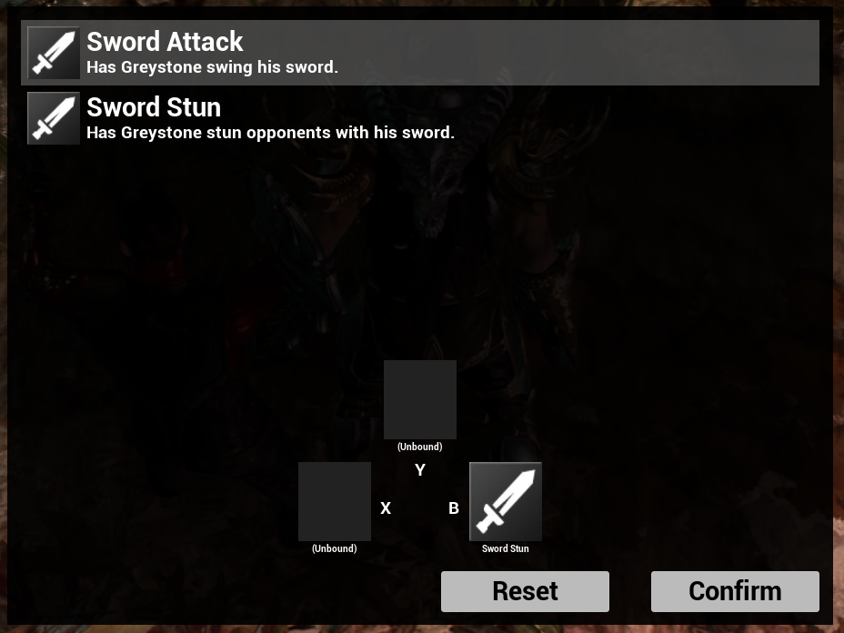

# OpenPF2Playground

Provides an Unreal Engine sample project for demonstrating how to use the OpenPF2 Role Playing Game (RPG) framework.

## Compatibility

This project is compatible with Unreal Engine 5.2.

## Current Status

This is a pre-alpha. Low-level framework code is in place but this is not yet a very fun/playable game. Still, there are
several interesting pieces to look at, including:
- How input gets bound to character abilities:
  - The bindings vary by character.
  - Default bindings can be specified on each character.
  - The player can remap which abilities are bound during play by bringing up the ability menu.
  - Bindings can be re-routed or filtered dynamically using "Ability Execution Filters". This is used to route 
    "Attack 1" to either an attack or movement action during encounters. 
- How game mode transitions are handled.
- How abilities get queued in encounter mode vs. executed immediately in exploration mode.
- How turns are orchestrated by AI behaviors during encounters.
- How the floating camera is handled (including its collision with the world relative to its tilt and zoom using a 
  custom collision component for delegating collision checks).

If something you'd like to see is not in this sample, please check back often! More is being added every week.

## Licensing

This is a free learning resource. If you intend to reproduce, repurpose, or
re-use any portion of this project in your own, you can only do so in an
Unreal-Engine-based project. See LICENSE.txt.

## Key Bindings/Input Bindings

### Outside Encounters ("Exploration" and "Downtime" Modes)

| Keyboard | Mouse         | XBox Controller             | Action                                          |
|----------|---------------|-----------------------------|-------------------------------------------------|
| W        |               | Left joystick (3) forward   | Walk character forward                          |
| A        |               | Left joystick (3) left      | Walk character left                             |
| S        |               | Left joystick (3) backward  | Walk character backward                         |
| D        |               | Left joystick (3) right     | Walk character right                            |
|          | Move forward  | Right joystick (1) forward  | Tilt camera down (turn character to look up)    |
|          | Move left     | Right joystick (1) left     | Tilt camera right (turn character to look left) |
|          | Move backward | Right joystick (1) backward | Tilt camera up (turn character to look down)    |
|          | Move right    | Right joystick (1) right    | Tilt camera left (turn camera to look right)    |
| 1        | Left click    | A                           | Use/Move/Attack 1                               |
| 2        |               | B                           | Attack 2                                        |
| 3        |               | X                           | Attack 3                                        |
| 4        |               | Y                           | Attack 4                                        |
| Q        |               | Left bumper (5)             | Control previous character                      |
| E        |               | Right bumper (10)           | Control next character                          |
| SHIFT    |               | Left trigger (6)            | Open/close ability dialog (hold to keep open)   |

### During Encounters ("Encounter" Mode)

| Keyboard | Mouse            | XBox Controller             | Action                                                |
|----------|------------------|-----------------------------|-------------------------------------------------------|
|          | Move forward     | Left joystick (3) forward   | Move encounter cursor up in screen space              |
|          | Move left        | Left joystick (3) left      | Move encounter cursor left in screen space            |
|          | Move backward    | Left joystick (3) backward  | Move encounter cursor down in screen space            |
|          | Move right       | Left joystick (3) right     | Tilt camera left (turn camera to look right)          |
| W        |                  | Right joystick (1) forward  | Fly camera forward                                    |
| A        |                  | Right joystick (1) left     | Fly camera left                                       |
| S        |                  | Right joystick (1) backward | Fly camera backward                                   |
| D        |                  | Right joystick (1) right    | Fly camera right                                      |
| Z        |                  | D-Pad (2) right             | Zoom camera in on active character                    |
| C        |                  | D-Pad (2) left              | Zoom camera out from active character                 |
|          | Mouse wheel up   | D-Pad (2) up                | Tilt camera down and zoom in towards active character |
|          | Mouse wheel down | D-Pad (2) down              | Tilt camera up and zoom out from active character     |
| 1        | Left click       | A                           | Use/Move/Attack 1 (depending on target square)        |
| 2        |                  | B                           | Attack 2                                              |
| 3        |                  | X                           | Attack 3                                              |
| 4        |                  | Y                           | Attack 4                                              |
| Q        |                  | Left bumper (5)             | Control previous character                            |
| E        |                  | Right bumper (10)           | Control next character                                |
| SHIFT    |                  | Left trigger (6)            | Open/close ability dialog (hold to keep open)         |

### In Ability Dialog

| Keyboard       | Mouse | XBox Controller   | Action                                                                              |
|----------------|-------|-------------------|-------------------------------------------------------------------------------------|
| Down arrow/S/D |       | D-Pad (2) down    | Select first ability/Move ability cursor/selection down in ability list             |
| Up arrow/W/A   |       | D-Pad (2) up      | Select last ability/Move ability cursor/selection up in ability list                |
| 2              |       | B                 | Bind ability to attack 2                                                            |
| 3              |       | X                 | Bind ability to attack 3                                                            |
| 4              |       | Y                 | Bind ability to attack 4                                                            |
| Q              |       | Left bumper (5)   | Switch to bindings for previous character                                           |
| E              |       | Right bumper (10) | Switch to bindings for next character                                               |
| SHIFT          |       | Left trigger (6)  | Open/close ability dialog (hold to keep open; release to activate selected ability) |

